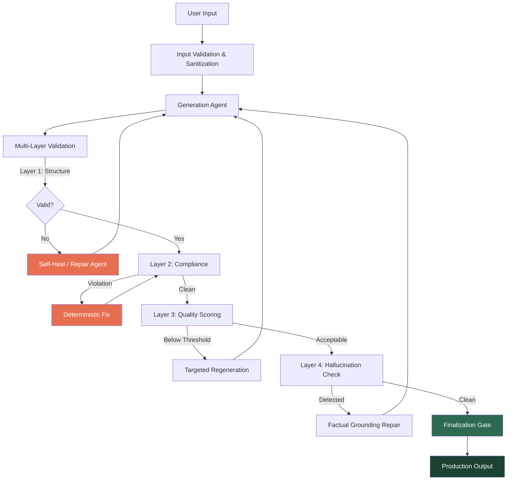

# AI Governance & Controlled AI Systems

**Author:** Sumit Kumar | AI Governance & Enterprise Advisory

---

## Overview

Enterprise AI adoption is accelerating — but most organizations lack the governance infrastructure to ensure reliability, compliance, and trust. This repository captures frameworks, patterns, and real-world implementations for building AI systems that are not only intelligent, but **controlled, auditable, and aligned with business and regulatory expectations**.

This work is the product of **70+ engineering sessions** building production AI systems in regulated industries — distilling hard-won lessons into reusable governance artifacts.

---

## Repository Structure

### [Frameworks](./frameworks/)
Industry-agnostic AI governance frameworks developed through hands-on implementation:

| Framework | Description |
|---|---|
| [AI Governance Framework](./frameworks/ai-governance-framework.md) | End-to-end governance model covering lifecycle, roles, controls, and escalation |
| [Compliance-by-Design](./frameworks/compliance-by-design.md) | Embedding regulatory compliance into AI pipelines through deterministic guardrails |
| [Multi-Layer Validation Architecture](./frameworks/validation-architecture.md) | 4-layer validation system for catching hallucinations, policy violations, and quality failures |
| [Audit & Accountability Framework](./frameworks/audit-accountability.md) | Structured audit methodology with agent hierarchy, adversarial testing, and governance documentation |
| [Regulatory Alignment Mapping](./frameworks/regulatory-alignment.md) | Detailed mapping to NIST AI RMF, EU AI Act, and ISO/IEC 42001 with implementation evidence |

### [Implementation Patterns](./patterns/)
Production-tested code patterns for governed AI systems:

| Pattern | Description |
|---|---|
| [Hallucination Prevention](./patterns/hallucination-prevention/) | Multi-layer validation gates, banned content detection, factual grounding |
| [Self-Healing Pipelines](./patterns/self-healing-pipelines/) | Generate → Validate → Repair loops with automatic recovery |
| [Output Quality Scoring](./patterns/output-quality-scoring/) | Composite quality scoring with per-dimension breakdown and confidence indicators |
| [Cost Governance](./patterns/cost-governance/) | Per-user LLM cost tracking, budget controls, and usage analytics |

### [Case Studies](./case-studies/)
Abstracted case studies from production AI governance implementations:

| Case Study | Description |
|---|---|
| [Regulated Content Generation](./case-studies/regulated-content-generation.md) | Governing AI-generated content in compliance-sensitive industries |
| [Multi-Agent Governance](./case-studies/multi-agent-governance.md) | Coordinating governance across 5+ specialized AI agents |
| [Production AI Quality Gates](./case-studies/production-ai-quality-gates.md) | The Finalization Principle — ensuring only validated outputs reach users |

### [Perspectives](./perspectives/)
Thought leadership on AI governance in practice:

| Article | Description |
|---|---|
| [From Experimental to Governed](./perspectives/from-experimental-to-governed.md) | A practitioner's roadmap for maturing AI systems |
| [Governance Accelerates Innovation](./perspectives/governance-accelerates-innovation.md) | Why governance is a competitive advantage, not a bottleneck |

---

## Core Philosophy

### Governance is not a gate — it is an accelerator.

Organizations that treat governance as an afterthought face:
- Regulatory risk from uncontrolled AI outputs
- Reputational damage from hallucinated or biased content
- Technical debt from ungoverned model sprawl
- Loss of stakeholder trust

Organizations that embed governance into their AI lifecycle gain:
- **Speed**: Validated outputs ship faster because they don't require manual review cycles
- **Trust**: Stakeholders adopt AI tools when they can see the controls
- **Scalability**: Governance patterns replicate across use cases without per-project reinvention
- **Compliance**: Regulatory alignment is continuous, not a last-minute scramble

### The Hybrid Principle

The most reliable AI systems combine:
- **Deterministic rules** for compliance, safety, and policy enforcement
- **AI reasoning** for language, creativity, and pattern recognition
- **Human oversight** for edge cases, quality standards, and strategic decisions

This architecture delivers the flexibility of AI with the reliability of traditional software — and it's auditable end-to-end.

---

## Reference Architecture

---

## Key Metrics from Production Systems

| Metric | Value | Context |
|---|---|---|
| Content compliance rate | 98%+ | After governance pipeline implementation |
| First-pass clean rate | 84% | Content passing all validation layers on first generation |
| Hallucination leak rate | 0% | After 4-layer validation deployment |
| Self-heal success rate | 92% | Automatic recovery without human intervention |
| Test coverage | 1,000+ tests | Governance-specific regression anchors |
| Cost per AI operation | < $0.001 | With cost governance controls |

---

## Regulatory Landscape Awareness

These frameworks have been developed with awareness of:
- **EU AI Act** — Risk classification, transparency requirements, human oversight mandates
- **NIST AI RMF** — Risk management lifecycle, governance functions, measurement
- **ISO/IEC 42001** — AI management system standards
- **Industry-specific regulations** — Fair lending (ECOA/HMDA), fair housing (FHA), healthcare (HIPAA), financial services (SR 11-7, OCC guidance)

---

## About the Author

Sumit Kumar is an AI governance practitioner focused on bridging the gap between AI innovation and enterprise readiness. With 70+ sessions of production AI system development in regulated industries, his work demonstrates that **responsible innovation and rapid delivery are not in conflict** — they are complementary when governance is designed into the system, not bolted on after.

**Areas of expertise:**
- AI governance framework design and implementation
- Multi-agent system architecture with compliance controls
- Hallucination prevention and content quality assurance
- Regulatory compliance automation (fair housing, fair lending, data privacy)
- Stakeholder advisory on responsible AI adoption

---

*This repository represents applied AI governance — not theory, but patterns and frameworks proven in production systems serving regulated industries.*
